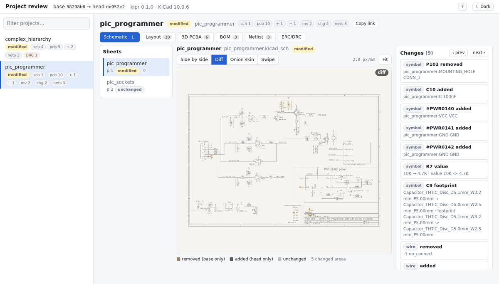
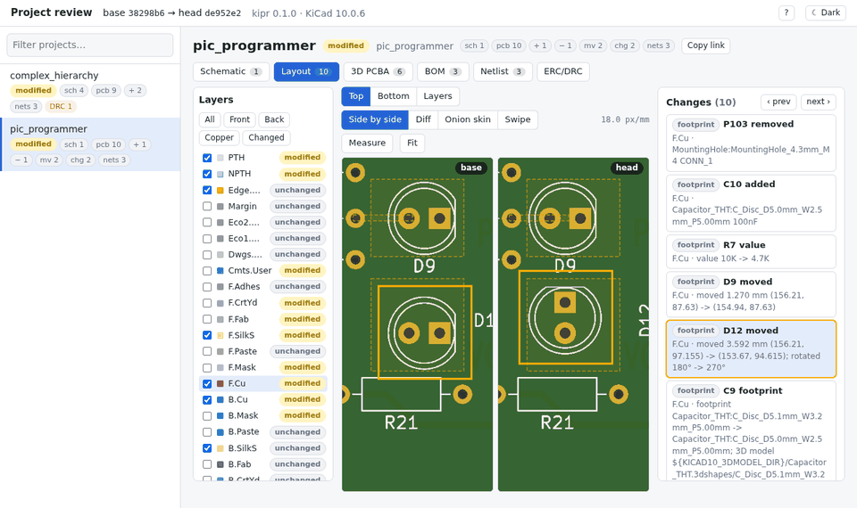
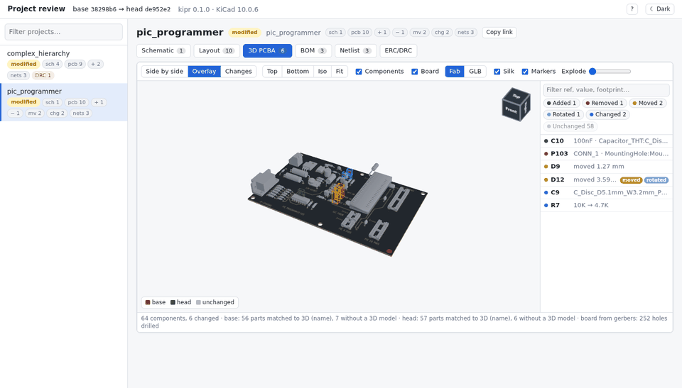
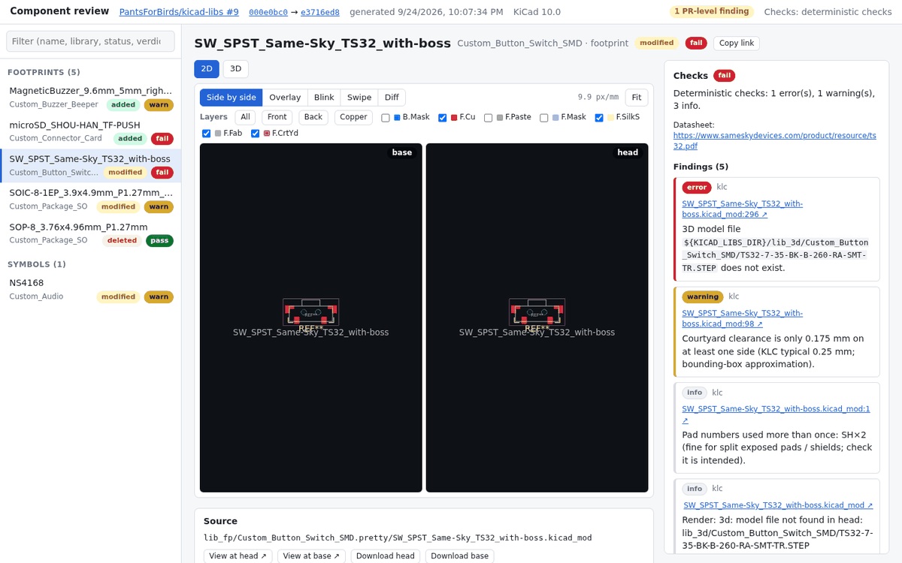

# kipr

Pronounced "keeper". Think KiCad-PR, but also "those design changes look all right, that's a keeper".

Automated review of KiCad changes in pull requests, in one place. kipr compares two commits of a
repository and shows what changed, as an interactive viewer (a static site that also opens from
disk) and as one self-contained HTML report. It ships as a Python package with a `kipr` command
and as reusable GitHub Actions workflows.

| | **Library review** (`kipr library`) | **Project review** (`kipr project`) |
|---|---|---|
| For | symbol / footprint / 3D model libraries | KiCad projects (boards) |
| Finds | changed symbols, footprints and 3D models | projects whose schematic, board, lib tables, project libraries or 3D models changed |
| Shows | before / after / diff renders per layer, 3D previews | schematic sheet diffs, per-layer layout diffs rendered from the gerbers, a 3D PCBA diff |
| Checks | KLC-style and deterministic checks, optionally KiCad's KLC checker | semantic diffs of components, footprints, tracks, zones, outline, BOM and netlist; new and fixed ERC/DRC violations |
| On a PR | sticky comment, inline review, check run, GitHub Pages preview | sticky comment with a summary table, annotations on new ERC/DRC violations, artifacts |
| Docs | [docs/library.md](docs/library.md) | [docs/project.md](docs/project.md), data contract [docs/CONTRACT-project.md](docs/CONTRACT-project.md) |

## Project review



| Layout: gerbers, side by side | 3D PCBA: base red, head green |
|---|---|
|  |  |

The screenshots show the public test fixtures: KiCad's pic_programmer demo with scripted edits
(`tests/project/fixtures/`).

## Library review



## Quick start

Needs Python 3.10+, git and the system cairo library (`libcairo2`). KiCad 10's `kicad-cli` is
needed for the project exports (without it `kipr project` still gives the semantic diffs) and is
optional for the library review.

```sh
pip install "kipr @ git+https://github.com/CoolNamesAllTaken/kipr@main"   # pin a sha or tag in CI

# a board repository: review + viewer + report in review/
kipr project --repo . --base "$(git merge-base origin/main HEAD)" --head HEAD --out review/
python3 review/serve.py            # or open review/index.html; review/project-review.html is the report

# a symbol/footprint library repository
kipr library --repo . --base "$(git merge-base origin/main HEAD)" --head HEAD --out cr-out
python3 cr-out/serve.py            # cr-out/component-review.html is the report
```

Both commands run their stages end to end; each stage is also a subcommand
(`kipr project review|site|report`, `kipr library render|checks|site|report`), `--skip STAGE`
leaves one out, and `kipr <library|project> ci ...` holds the GitHub glue. See `--help`.

## GitHub Actions

Each review is a pair of reusable workflows: an unprivileged one that runs on the PR (read-only
token, no secrets) and produces artifacts, and a privileged `workflow_run` one that runs from the
default branch, never executes PR code and posts the results. Callers pin kipr to one sha:

```yaml
# .github/workflows/kicad-review.yml in a board repository
name: KiCad project review
on:
  pull_request:
    paths: ['**/*.kicad_pcb', '**/*.kicad_sch', '**/*.kicad_pro']
permissions:
  contents: read
jobs:
  review:
    uses: CoolNamesAllTaken/kipr/.github/workflows/project-review.yml@KIPR_SHA
    with:
      kipr-ref: KIPR_SHA
```

```yaml
# .github/workflows/component-review.yml in a library repository
name: Component review
on:
  pull_request:
    paths: ["lib_fp/**", "lib_sch/**", "lib_3d/**"]
permissions:
  contents: read
jobs:
  review:
    uses: CoolNamesAllTaken/kipr/.github/workflows/library-review.yml@KIPR_SHA
    with:
      kipr-ref: KIPR_SHA
```

The publish (and, for libraries, cleanup) callers and all inputs are in
[docs/project.md](docs/project.md#github-actions) and [docs/library.md](docs/library.md#github-actions).

## Layout

| Path            | What                                                         |
|-----------------|--------------------------------------------------------------|
| `kipr/common/`  | shared Python: s-expression parsing, kicad-cli, git helpers  |
| `kipr/library/` | library (symbol / footprint / 3D model) review               |
| `kipr/project/` | project (schematic / layout / 3D PCBA) review                |
| `web/library/`, `web/project/` | the interactive viewers (static, no build step; shipped in the wheel) |
| `docs/`         | usage, CI workflows and the data contract                    |
| `tests/`        | pytest, node and browser tests; CI in `.github/workflows/*-tests.yml` |

## License

MIT (see [LICENSE](LICENSE)). Vendored third-party code keeps its own (MIT) license: three.js in
`web/project/pcba3d/vendor/` and our fork of wasm-gerber-viewer's renderer in `web/project/vendor/`.
